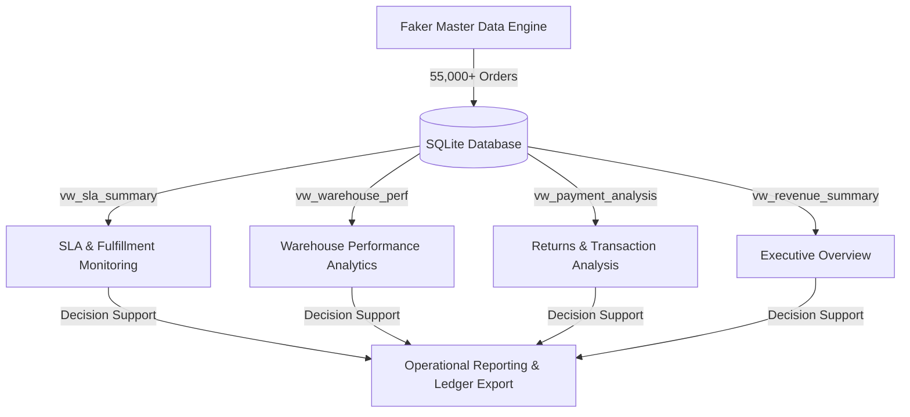

# OpsIntel: Business Operations Intelligence Platform

### Enterprise Decision Support & Operational Analytics

**OpsIntel** is a professional, centralized business operations intelligence and reporting platform designed for Business Analysts, Operations Analysts, Product Analysts, and SAP Support roles. The platform acts as an interactive analytical layer over simulated enterprise e-commerce transactional data, enabling stakeholders to audit delivery lifecycles, identify dispatch bottlenecks, monitor SLA compliance, and minimize reverse-logistics exposure.

---

## Executive Platform Architecture



---

## Core Analytical Modules

The platform is structured into six clean, highly interactive reporting pages, each designed for key operational roles:

### 1. Executive Overview
Provides a unified view of corporate key performance indicators (KPIs) and high-level health metrics:
*   **Metric Grid**: Flat, SAP-style KPI cards displaying total order volumes, gross realized revenue, fulfillment success rates, and customer experience indices (CSAT).
*   **Business Observations**: Actionable highlight boards tracking supply chain issues and return exposures without informal notation or emojis.
*   **Chronological Trends**: Spline-based visualization of gross monthly revenue and regional order contribution splits.

### 2. Order Operations Analytics
Delivers processing cycle reporting and transaction load tracking:
*   **Lifecycle Splitting**: Analysis of order counts across different processing states (Delivered, Shipped, Processing, Cancelled, Returned, Failed).
*   **Transaction Density**: Chronological load auditing across the 24-hour cycle to identify peak transaction loads.
*   **Operational Attrition**: Comparative review of category-specific cancellation and return percentages.

### 3. SLA & Fulfillment Monitoring
Audits logistics partner capability and lead-time adherence:
*   **SLA Compliance**: Detailed metrics mapping carrier turnaround times and breach rates.
*   **Carrier Benchmarking**: Comparative analysis correlating unit volumes against mean transit cycle times.
*   **Segment Risk Heatmap**: Pivot matrix matching regions with product categories to isolate high-risk supply corridors.

### 4. Returns & Transaction Analysis
Identifies gateway processing degradations and reverse-logistics overheads:
*   **Financial Leakage**: Dynamic capture of failed checkouts, lost revenue, and mean transactional risk profiles.
*   **Settlement Analysis**: Direct comparison of Cash-on-Delivery (COD) vs. Prepaid return rates.
*   **Root Cause Analysis**: Treemaps of gateway failures and horizontal bar charts of customer return rationale.

### 5. Warehouse Performance Analytics
Models fulfillment center efficiency and constraints:
*   **Fulfillment Center Indexing**: Calculates a composite **Warehouse Efficiency Rating (0-100)** incorporating throughput, SLA compliance, CSAT rating, and sorting speed.
*   **Radar Profiling**: Polar chart benchmarking of regional warehouse performance across multiple dimensions.
*   **Throughput Correlation**: Bubble charts mapping unit volumes, satisfaction scores, and logistics breaches.

### 6. Operational Reporting
Serves as an executive decision center and custom data extractor:
*   **Recommended Action Plans**: Dynamic business observations with logical remediation guidelines.
*   **Custom Ledger Exporter**: Interactive column and region filter system allowing analysts to compile custom reports and export ERP/SAP-compatible CSV spreadsheets.

---

## Technology Stack

The platform is built upon a high-performance Python data science stack:
*   **Main Dashboard Engine**: `Streamlit (v1.35.0)`
*   **Data Processing**: `Pandas (v2.2.2)`, `NumPy (v1.26.4)`
*   **Database Infrastructure**: `SQLite`, `SQLAlchemy (v2.0.30)`
*   **Data Visualization**: `Plotly (v5.22.0)` (Express & Graph Objects)
*   **Dataset Generation**: `Faker (v25.2.0)`
*   **Design Customization**: Vanilla CSS styling for clean corporate grids and cards.

---

## Deployment & Local Installation

### Prerequisites
*   Python 3.9 or higher installed.

### Setup Instructions
1.  Clone the repository to your local system:
    ```bash
    git clone https://github.com/ashleshak16/Business-Operations-Intelligence-Platforms.git
    cd Business-Operations-Intelligence-Platforms
    ```

2.  Create and activate a clean virtual environment:
    ```bash
    # On macOS/Linux:
    python3 -m venv venv
    source venv/bin/activate
    
    # On Windows:
    python -m venv venv
    venv\Scripts\activate
    ```

3.  Install dependencies:
    ```bash
    pip install -r requirements.txt
    ```

4.  Start the platform local server:
    ```bash
    streamlit run app.py
    ```

---

## Cloud Deployment (Streamlit Community Cloud)

This platform is configured for instant hosting:
1.  Navigate to [share.streamlit.io](https://share.streamlit.io) and log in with your GitHub account.
2.  Click **Create App** and select this repository: `ashleshak16/Business-Operations-Intelligence-Platforms`.
3.  Configure **Main file path** as: `app.py`.
4.  Click **Deploy**. On the first launch, the cloud server will automatically initialize, synthesize the 55,000+ row database, and compile the dashboard in ~15 seconds.

---
*Classification: Internal Operations | Decision Support Systems | Enterprise Analytics*
